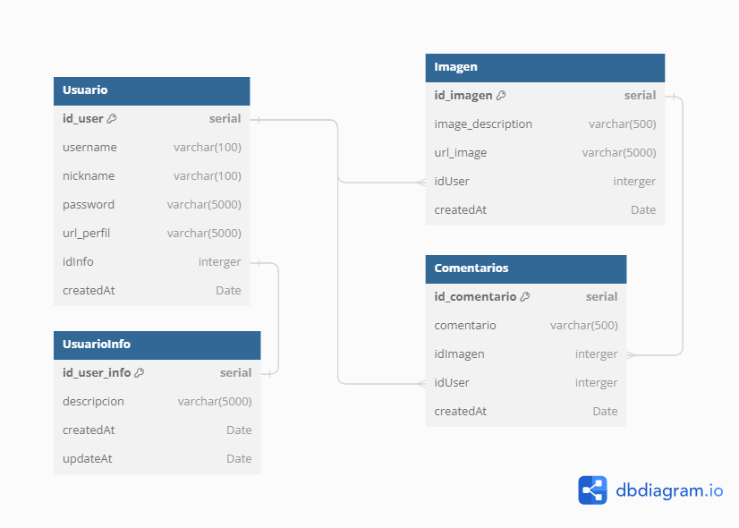

# Api servidor para SocialPablo

En estos archivos se encuentra el codigo de la api para SocialPablo

## Recursos

- Lenguajes: Typescript, javascrip;
- Tecnologias: Express, typeorm, postgresql

## Estructura de datos

En la siguiente imagen se muestran las tablas y las relaciones de los datos.

